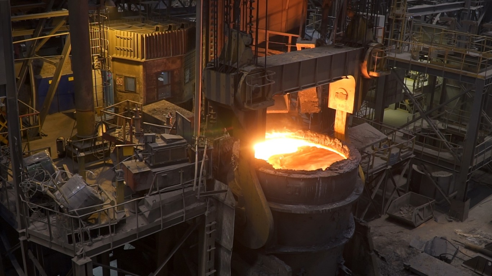

# Прогнозирование температуры стали
## Описание проекта

Металлургический комбинат хочет снизить потребление электроэнергии при обработке стали. Для этого необходимо контролировать температуру расплава и разработать модель для её прогнозирования.

**Цель проекта** — построить модель машинного обучения, которую заказчик сможет использовать для имитации технологического процесса.

## Технологический процесс

Сталь обрабатывают в металлическом ковше вместимостью около 100 тонн. Расплав нагревают до нужной температуры с помощью графитовых электродов.

Процесс включает несколько этапов:

1. **Десульфурация** — удаление серы и корректировка химического состава.
2. **Легирование** — добавление необходимых сплавов и примесей.
3. **Перемешивание** — продувка стали инертным газом.
4. **Контроль параметров** — измерение температуры и химического состава.

Цикл измерений и добавления материалов повторяется до достижения требуемого состава и температуры.

После обработки сталь направляется на дальнейшую доводку или в машину непрерывной разливки, где формируется в виде заготовок-слябов.

## Описание данных

Для построения модели необходимо проанализировать данные технологического процесса, определить значимые параметры и учитывать последовательность производственных операций.

Особое внимание уделяется временной зависимости измерений, поскольку модель планируется использовать для имитации реального технологического процесса.

## Описание данных

Данные хранятся в **SQLite** и представлены семью таблицами. Общий идентификатор партии — `key`.

| Таблица          | Описание                        |
| ---------------- | ------------------------------- |
| `data_arc`       | Нагрев электродами              |
| `data_bulk`      | Объём сыпучих материалов        |
| `data_bulk_time` | Время подачи сыпучих материалов |
| `data_gas`       | Объём подаваемого газа          |
| `data_temp`      | Измерения температуры           |
| `data_wire`      | Объём проволочных материалов    |
| `data_wire_time` | Время подачи проволоки          |

> Несколько записей с одинаковым `key` соответствуют разным итерациям обработки одной партии.

## Цели и целевые метрики
- Значение метрики MAE должно быть менее 6.8;
- Дополнительно можете оценить R²;
- Определить наиболее важные признаки и вынести предложения;